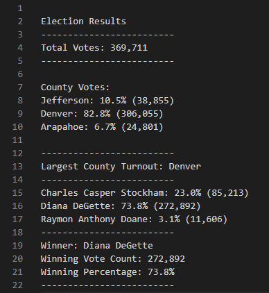
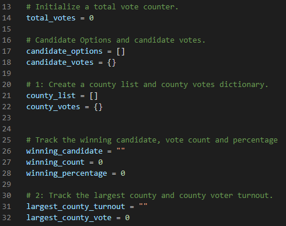
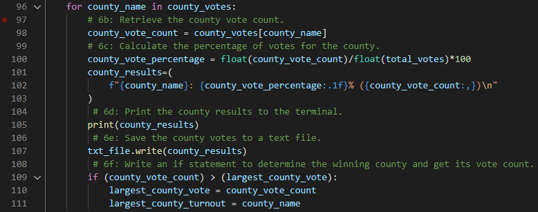
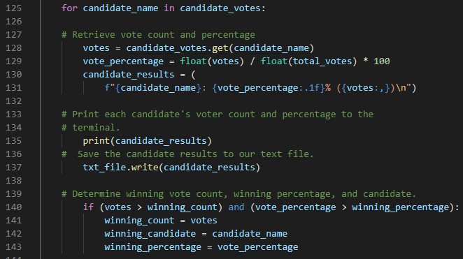

# Election Analysis
## Overview of Election Audit
The purpose of this project is to help client Tom and the Colorado Board of Elections determine not only who won the election, but also:
* Total number of votes cast.
* A complete list of candidates who received votes.
* Total number of votes each candidate received.
* Percentage of votes each candidate won.
* A complete list of counties in which votes were cast.
* Total number of votes per county.
* Percentage of votes per county.
* The county with the most votes counted.
This was accomplished by using Python to read each line of the data provided and analyze based on conditions previously defined and set.
## Election Audit Results 

### Total Votes
There were 369,711 total votes cast in this election.
### Counties Participating
The counties participating in this election were:
* Jefferson
* Denver
* Arapahoe
### The Total Votes per County
* Jefferson: 38,855 votes
* Denver: 306,055 votes
* Arapahoe: 24,801 votes
### Vote Percentages per County
* Jefferson: 23.0%
* Denver: 73.8%
* Arapahoe: 6.7%
### County with Highest Turnout
Denver
### List of Candidates Who Received Votes
* Charles Casper Stockham
* Diana DeGette
* Raymon Anthony Doane
### Total Votes per Candidate
* Charles Casper Stockham: 85,213 votes
* Diana DeGette 272,892 votes
* Raymon Anthony Doane 11,606 votes
### Vote Percentages per Candidate
* Charles Casper Stockham: 23.0%
* Diana DeGette: 73.8%
* Raymon Anthony Doane: 3.1%
### Winner of Election
Diana DeGette

## Election Audit Summary

I would like to present the code above to the Colorado Board of Election as a way to easily sort through election data and determine not only winners of elections based upon total votes received and vote percentage, but also as a means to determine voter turnout based upon region, in this case, counties. 
### Example 1
One way this code could be repurposed is to apply it to a national election, where the defined regions are states instead of counties. There would be far more data to read, but this code could easily be modified to analyze the data and provide the same outcomes.
### Example 2
Another way this code could be repurposed is to read voter demographics, which could provide essential data to potential candidates on who is voting for them, from what region, and from what age ranges. This could prove invaluable as if a candidate was not performing well with a certain group, they could campaign more heavily towards that demographic and potentially win them over.
